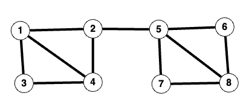

# _Girvan-Newman Algorithm for community detection_

| By          | HARIRPRASAD SIVAPATHAM ANAND     |
| ----------- | -------------------------------- |
| ID          | 202205341                        |
| Subject     | Data mining and Machine learning |
| Github Link | [Link](https://github.com/SAHARIPRASAD-2907/data_mining_article) |

**Tutorial** : The working procedure of a community detection algorithm.

## _1 Introduction_

The easiest way to understand peoples behavior and their interactions is by representing the behavior in the form of a graph. A graph majorly consists of vertices and edges. Graph mining algorithms are used my companies like facebook to get you connections with a layer of friends and companies such as Amazon make recommendation system to know a persons preferences by forming clusters.

The concept of graph mining uses features to see how a set of observations are related from a user facing similarity signals. Graphs represent relationships between entities which are formulated based on distances. There are 2 major characteristics found in graph's :-

**An example of Natural graph and similarity graph**

| Natural Graph                                                                                               | Similarity Graph                                                                                                                                                             |
| ----------------------------------------------------------------------------------------------------------- | ---------------------------------------------------------------------------------------------------------------------------------------------------------------------------- |
|       |                                                                 |
| Naturel graphs which comes from an external source. For example payment networks, social media and roadway. | Similarity Graphs which comes from measures of similarity distance between nodes. For example a blob of metadata then shares the blob structure via graph representation[2]. |

Graphs are multipurpose. You can build supervised models by classifying surrounding neighbors, semi-supervised models by propagating existing labels to missing labels in the neighborhood, and unsupervised models by training node-level embeddings to describe structural role of the data[2].

In the following tutorial we will be working on one of the most unique community based clustering algorithm called **Girvan-Newman** algorithm which separates the network based on the edge betweens.

### Motivation

The major motivation to study Given-Newman algorithm is that it helps to separate the networks into communities, and the community detection can be used as a good start for data preprocessing.[3]

### Applications

- The definition of edge betweens is that it finds the shortest path that pass along the edges.
- The major use of edge betweens is to find the weakest link in a graph and remove it to form communities.
- Edge betweens measures the **bridgeness** of an edge between two communities.
- The edge with high betweens tends to be the bridge between two communities

## _2 Community detection Algorithms_

Community detection algorithm helps to understand the users better. The users can be identified based on their interests. Groups provide a clear global view of user interactions. Some behaviors are only observable in a group setting and not on an individual level.

The major finding's through community detection are

1. The process of finding clusters of nodes ("communities")
   - With strong internal connections and
   - Weak connections between different communities
2. Ideal decomposition of a large graph
   - Completely disjoint communities
   - There are no interactions between different communities
3. Find community partitions that are maximally decoupled.

### _2.1 Given Newman algorithm_

The following algorithm was proposed in the year 2002 by M.Girvan and M.E.j Newman in their paper community structure in social and biological network.
[Link to paper](https://www.pnas.org/doi/10.1073/pnas.122653799)

## _3 Working Procedure of Given Newman Algorithm_

First we need to compute the edge betweens of every edge in the graph

1. Select a node X, and perform BFS to find number of shortest path from the node X to each node, and assign the numbers as score to each node.
2. Starting from the leaf node, we calculate the credit of edge by:

$(1+(sum\,of\,the edge\,credits\,to\,the\,node))*(score\,of\,destination\,node / score\,of\, starting\,node)$

3. Compute the edge credits of all edges in the graph G, and repeat from step 1. Until all of the nodes are selected.
4. Sum up all of the edge credit we compute in step 2 and divide by 2, and the result is the edge betweens of edges.

Next, we remove the edges with the highest edge betweens, and repeat until we find the good community split.

5. Remove the edges with the highest edge betweens.
6. Compute the modularity Q of the communities split.
7. Repeat from step 1, if Q is greater than 0.3-0.7.

### _3.1 Theory based approach_

We will consider the following graph



First, we select node 1 and find the number of shortest path from the node H to each of the node.

**Distance from node 1**

SD - Shortest Path
EB - Edge Betweens

| Nodes | SD 1 |
| ----- | ---- |
| 1     | 0    |
| 2     | 1    |
| 3     | 1    |
| 4     | 2    |
| 5     | 1    |
| 6     | 1    |
| 7     | 1    |
| 8     | 2    |

First, We select a node 1 and find the number of shortest path from the node 1 to each of the node.

It is obvious that there is only one shortest path from node 1 to 2, which is N(1,2). Therefore, we assign 1 to the node G as the node score.

Likewise, there are 2 shortest paths from node 1 to 4 which are {124,134}.

The edge N(1,4) and N(5,8) can be ignored because their node are in the same depth in the BFS tree, and they won't be taken into account in counting the shortest path.

Next, we need to calculate the credit of each edge starting from the leaf node (Node 2) using the following formula, where the score is computed in step 1.

$EdgeCredit = (1 + \sum IncomingEdgeCredit)*(ScoreOfDestination/ScoreOfStart)$

EB(7,8) = EB(8,6) = 0.5
EB(5,7) = EB(5,6) = (1+0.5) * 1/1 = 1.5
EB(2,5) = (1+1.5+1.5)*1/1 = 4
EB(3,4) = EB(2,4) = 0.5
EB(1,3) = (1+0.5)\*1/1 = 1.5
EB(1,2) = (1+4+0.5)\*1/1 = 5.5

Similarly we can calculate for other nodes. And we get a final edge betweens as follows.

EB(1,2) = 7.5 ,EB(3,4) = 3.5, EB(6,8) = 1.5
EB(1,3) = 1.0 ,EB(5,6) = 5.5  
EB(1,4) = 3.5 ,EB(5,8) = 5.0
EB(2,4) = 7.5 ,EB(5,7) = 5.5
EB(2,5) = 16 ,EB(7,8) = 1.5

Link of the above theory using networkx is available in the following [Link](./code.ipynb)

As expected, N(2,5) has the highest edge betweens, thereby we remove teh edge N(2,5), and forming two communities.

### _3.2 Code based approach using networkx Library_

The following algorithm can be implemented using the networkx python library.

#### Sample code

```python
import matplotlib.pyplot as plt
import networkx as nx
from networkx.algorithms.community.centrality import girvan_newman

G = nx.karate_club_graph()
communities = girvan_newman(G)

node_groups = []
for com in next(communities):
    node_groups.append(list(com))

print(node_groups)

color_map = []
for node in G:
    if node in node_groups[0]:
        color_map.append("red")
    else:
        color_map.append("orange")
nx.draw(G, node_color=color_map, with_labels=True)
plt.show()
```

#### Sample output

```
[[0, 1, 3, 4, 5, 6, 7, 10, 11, 12, 13, 16, 17, 19, 21],
[2, 8, 9, 14, 15, 18, 20, 22, 23, 24, 25, 26, 27, 28, 29, 30, 31, 32, 33]]
```

### Output Visualization


## _4 Strengths and weakness of Given Newman Algorithm_

### _4.1 Strengths_

1. The community detection method clearly detects community peripheries through edge betweens in comparison to other algorithms that focus on strong connection cores to detect communities.
2. The algorithm works well with computer generated graphs as well as real world graphs by producing well documented communities which solved exceptions in previous algorithms.
3. The algorithm can be used in areas such as marketing and advertisements to find the most dense node of their graph and make promotions accordingly.

### _4.2 Weakness_

1. The algorithm runs with a very high time complexity of $O(n^3)$ where n is the number of vertices hence it makes it difficult to work with very large graphs.
2. The algorithm performs well with sparse networks but cannot perform well with dense networks.
3. The algorithm does not consider weights of graph nodes while calculating edge betweens.

## _5 Improvements_

In the future the algorithm can be improved to handle both weighted and directed graphs. The algorithm can also incorporate functional clusters within neural networks to analysis of communities on the Worldwide Web, as well as other networks under discovery. Another possibility is that if the graph is highly dense it can be divided into sub parts and use divide and conquer to calculate overall edge betweens to improve overall performance.

## _6 Conclusion_

Community detection is very applicable in understanding and evaluating the structure of large and complex networks. This approach uses the properties of edges in graphs or networks and hence more suitable for network analysis rather than a clustering approach. The clustering algorithms have a tendency to separate single peripheral nodes from the communities it should belong to. Many different algorithms have proposed and implemented for network community detection. The following algorithm Griven-Newman algorithm is the only algorithm that uses a unique way of identifying communities through edge betweens.[4]

## _References_

1. https://towardsdatascience.com/understanding-graph-mining-e713183a64f3

2. https://www.pnas.org/doi/10.1073/pnas.122653799

3. https://medium.com/analytics-vidhya/girvan-newman-the-clustering-technique-in-network-analysis-27fe6d665c92

4. https://towardsdatascience.com/community-detection-algorithms-9bd8951e7dae

5. https://networkx.guide/algorithms/community-detection/girvan-newman/

6. https://graphonline.ru/en/
